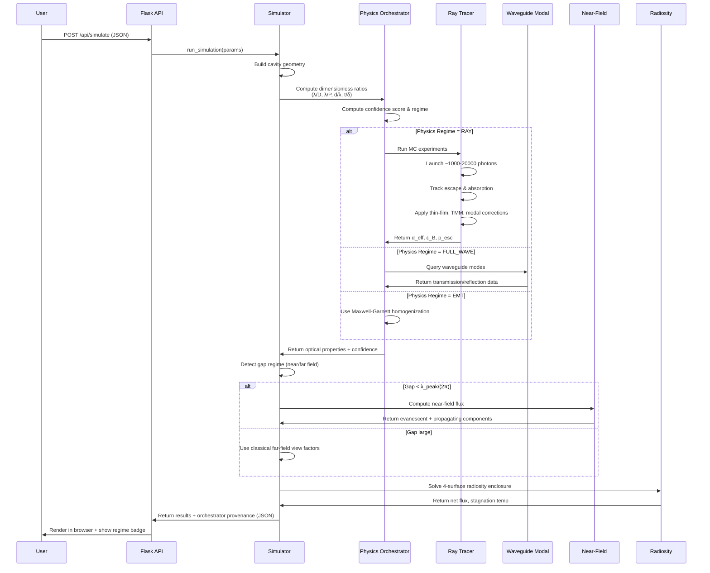
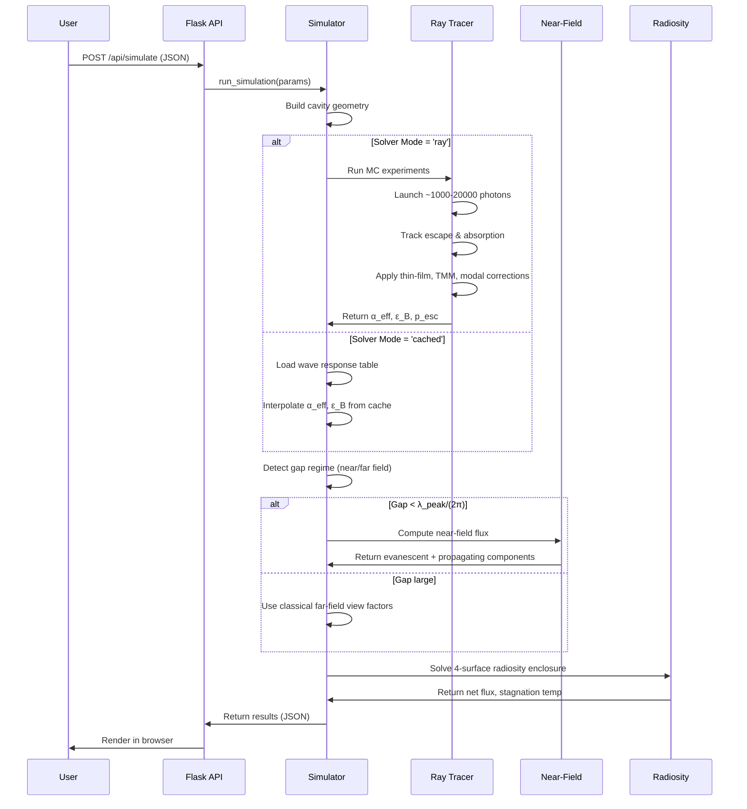

# Monte Carlo Radiative Exchange Simulator

A web-based tool for modeling radiative heat transfer between two plates when one surface is **micro-structured**. The simulator combines **3-D Monte Carlo ray tracing**, **thin-film optics**, **waveguide modal physics**, and optional **near-field transfer** to quantify **anisotropic energy decoupling** — how micro-structured surfaces can absorb incoming radiation efficiently while emitting thermal radiation poorly from inside their cavities.

## 🎯 The Core Idea

Most surfaces absorb and emit radiation equally (Kirchhoff's law). But micro-structured surfaces break this symmetry:

- **Top surface**: Incoming light → absorbed efficiently (α_eff ≈ 0.9–0.99)
- **Inside cavities**: Thermal photons → mostly trapped and recycled (ε_B ≈ 0.01–0.1)
- **Result**: Decoupling ratio up to 100:1, enabling advanced thermal engineering

This simulator runs **photon-scale Monte Carlo experiments** inside repeating cavity cells, accounting for:

1. **Thin-film effects** — 100 nm walls emit 35× less than bulk
2. **Waveguide cutoff** — photons longer than cavity diameter decay inside
3. **Complex optics** — wavelength-dependent refractive indices and interference
4. **Near-field transfer** — evanescent waves tunnel across tiny gaps
5. **Thermal radiosity** — combined heat flow across the complete enclosure

## 🧪 Key Physics

| Feature | How it works | Why it matters |
|---------|------------|-----------------|
| **Thin-film Beer–Lambert** | Walls thinner than absorption depth: `ε_eff(λ) = ε_bulk × [1 − exp(−t/δ)]` | 100 nm alumina: 2.2% vs. 80% (36× more accurate) |
| **Complex refractive index + TMM** | Full wavelength-dependent `n(λ) + ik(λ)` with phase-coherent Fresnel reflections | Captures Fabry–Pérot interference, oblique angles, s/p polarization |
| **Lossy waveguide modal cutoff** | Photons with λ > λ_c become evanescent; decay as `exp(−2L/δ_ev)` | Quantifies modal confinement; TE11: λ_c = 1.706 × diameter |
| **Spectral Planck sampling** | Each photon gets wavelength from thermal distribution; per-photon corrections applied | Accurate temperature-dependent behavior; 5-band model with Planck weighting |
| **Polder–Van Hove near-field** | For gaps < λ_peak/(2π): evanescent tunneling adds 2–100× flux | Auto-detected; seamless switch between near/far-field regimes |
| **Four-surface radiosity** | Plate A front/back + Plate B + surroundings; exact 3-D view factors | Net heat flow including reflections and enclosure effects |

### Geometry Modes

- **Honeycomb Cavity Panel** — cylindrical pores in hexagonal array (porous anodized alumina)
- **CNT Forest Panel** — tapered carbon nanotube pillars in square lattice
- Legacy: Frustum cavities and rectangular pits (backward compatible)

## 📊 Key Output Metrics

| Metric | Meaning | Interpretation |
|--------|---------|-----------------|
| **α_eff** | Effective absorptivity for incident light | Higher = better light trapping; typically 0.8–0.99 |
| **ε_B** | Effective emissivity from cavity | Lower = better thermal confinement; typically 0.01–0.1 |
| **Decoupling ratio** | α_eff / ε_B | >10 means strong anisotropy; this is the "magic" of the structure |
| **p_esc** | Probability photon escapes cavity | How many thermally emitted photons get out; typically 0.001–0.1 |
| **Net flux (Q)** | Heat flow from plate A to plate B | Watts/m²; sign tells you direction |
| **T_B_stag** | Adiabatic equilibrium temperature of plate B | Temperature plate B would reach if isolated; useful for validation |
| **physics_regime** | "Near-field" or "far-field" | Near-field only triggers when gap is extremely small |
| **Cutoff wavelength (λ_c)** | Longest wavelength that propagates | λ_c = 1.706 × cavity_diameter; longer wavelengths are evanescent |

## 🏗️ System Architecture

### Physics Orchestrator: Regime Selection

Before any solver runs, the **Physics Orchestrator** (`regime_selector.py`) detects which physics model is appropriate by computing dimensionless ratios:

| Ratio | Meaning | Threshold |
|-------|---------|-----------|
| **λ/D** | Wavelength vs. cavity diameter | < 0.2 → RAY, 0.2–5 → FULL_WAVE, > 5 → EMT |
| **λ/P** | Wavelength vs. pitch | EMT when both D, P ≪ λ |
| **d_gap/(λ/2π)** | Gap vs. evanescent tunnelling length | < 1 → NEAR_FIELD |
| **t_wall/δ** | Wall thickness vs. absorption depth | Optically thin if < 0.5 |

The orchestrator also **computes a confidence score** (0–100%) from regime penalties, temperature drift, and material extrapolation status. This is surfaced in the UI as a color-coded badge with explicit warnings.

### High-Level Data Flow

```mermaid
flowchart TD
    %% Class Definitions
    classDef default fill:#1e293b,stroke:#475569,stroke-width:1.5px,color:#f8fafc,font-family:sans-serif;
    classDef ioNode fill:#0f172a,stroke:#38bdf8,stroke-width:1.5px,color:#e0f2fe;
    classDef orchestrator fill:#0f172a,stroke:#2dd4bf,stroke-width:2.5px,color:#2dd4bf,font-weight:bold;
    classDef decision fill:#0f172a,stroke:#38bdf8,stroke-width:2px,color:#38bdf8,font-weight:bold;
    classDef rayMode fill:#064e3b,stroke:#34d399,stroke-width:1.5px,color:#ecfdf5;
    classDef fullWaveMode fill:#3730a3,stroke:#818cf8,stroke-width:1.5px,color:#e0e7ff;
    classDef emtMode fill:#701a75,stroke:#f0abfc,stroke-width:1.5px,color:#fdf4ff;
    classDef nearField fill:#7f1d1d,stroke:#f87171,stroke-width:1.5px,color:#fef2f2;
    classDef outputNode fill:#065f46,stroke:#10b981,stroke-width:2px,color:#ffffff,font-weight:bold;

    subgraph FLOW["🚀 High-Level Simulation Flow"]
        style FLOW fill:#0f172a,stroke:#0d9488,stroke-width:2px,color:#2dd4bf,font-weight:bold;

        User["👤 User Input<br/>(Browser UI)"] -->|JSON| API["🔗 Flask API<br/>POST /api/simulate"]
        API --> Sim["⚙️ Simulation Engine<br/>(Python backend)"]
        Sim --> Cavity["📦 Build Cavity<br/>Geometry"]
        Cavity --> Orchestrator["⚙️ Physics Orchestrator<br/>regime_selector.py"]

        Orchestrator -->|λ/D, λ/P, d/λ, t/δ| Solver{"🎲 Which Physics?"}

        Solver -->|RAY| MC["Monte Carlo<br/>ray_tracer.py"]
        Solver -->|FULL_WAVE| WaveSolve["Waveguide Modal<br/>waveguide_modes.py"]
        Solver -->|EMT| EMT["Maxwell-Garnett TMM<br/>material_optics.py"]

        MC --> Physics["✨ Apply Physics<br/>Corrections"]
        WaveSolve --> Physics
        EMT --> Physics

        Physics --> Regime{"🌡️ Gap Size<br/>Check"}
        Regime -->|gap < λ_peak/2π| NF["⚡ Near-Field<br/>near_field_radiative_heat.py"]
        Regime -->|gap large| FF["📡 Far-Field<br/>Radiosity"]

        NF --> Output["📋 Results<br/>JSON"]
        FF --> Output

        Output -->|JSON| Display["📊 Display Results<br/>Browser UI"]
    end

    %% Apply Classes
    class User,API,Display ioNode;
    class Orchestrator orchestrator;
    class Solver,Regime decision;
    class MC rayMode;
    class WaveSolve fullWaveMode;
    class EMT emtMode;
    class NF nearField;
    class Output outputNode;

    %% Link Styling (Mapped 0..17 to prevent render errors)
    linkStyle 0,1,2,3 stroke:#38bdf8,stroke-width:2px,fill:none;
    linkStyle 4 stroke:#2dd4bf,stroke-width:2px,fill:none;
    linkStyle 5 stroke:#34d399,stroke-width:2px,fill:none;
    linkStyle 6 stroke:#818cf8,stroke-width:2px,fill:none;
    linkStyle 7 stroke:#f0abfc,stroke-width:2px,fill:none;
    linkStyle 8 stroke:#34d399,stroke-width:2px,fill:none;
    linkStyle 9 stroke:#818cf8,stroke-width:2px,fill:none;
    linkStyle 10 stroke:#f0abfc,stroke-width:2px,fill:none;
    linkStyle 11 stroke:#38bdf8,stroke-width:2px,fill:none;
    linkStyle 12 stroke:#f87171,stroke-width:2px,fill:none;
    linkStyle 13 stroke:#38bdf8,stroke-width:2px,fill:none;
    linkStyle 14,15,16 stroke:#10b981,stroke-width:2px,fill:none;

### Monte Carlo Cavity Experiments

Two photon-scale experiments run inside the repeating unit cell:

**🔥 Internal Emission:**
- Photons launched from walls + base
- Planck-sampled wavelength
- If λ < λ_c: **Guided mode** → T = T_ap × exp(−αL)
- If λ ≥ λ_c: **Evanescent** → exp(−2L/δ_ev)
- **Output**: P_esc = escape fraction → drives **ε_B** (emission)

**☀️ External Incidence:**
- Photons enter from aperture
- Planck-sampled wavelength
- If λ < λ_c: **Trace into cavity** → TMM bounces
- If λ ≥ λ_c: **Diffract around rim**
- **Output**: α_eff = absorbed fraction (absorption)

### Component Hierarchy

=======
### Component Hierarchy

>>>>>>> 441c8066e5e47d89311c1e625fb490f4d2208ce8
```mermaid
graph LR
    subgraph Frontend["🖥️ Frontend"]
        HTML["index.html<br/>(Form + Display)"]
        JS["app.js<br/>(API calls)"]
        CSS["style.css<br/>(Styling)"]
    end
    
    subgraph API["🔗 API Layer"]
        Flask["Flask Server<br/>app.py"]
    end
    
    subgraph Physics["⚙️ Physics Engine"]
        Sim["Orchestration<br/>simulator.py"]
<<<<<<< HEAD
        Orchestrator["Physics Regime<br/>regime_selector.py"]
=======
>>>>>>> 441c8066e5e47d89311c1e625fb490f4d2208ce8
        Geo["Geometry Builder<br/>geometry.py"]
        Ray["Monte Carlo Tracer<br/>ray_tracer.py"]
        Samp["Sampling<br/>sampling.py"]
        Spec["Spectral Model<br/>spectral.py"]
        Mat["Optics & Materials<br/>material_optics.py"]
        Wave["Waveguide Modal<br/>waveguide_modes.py"]
        NF["Near-Field Model<br/>near_field_radiative_heat.py"]
<<<<<<< HEAD
        BRDF["BRDF Surface<br/>brdf.py"]
=======
>>>>>>> 441c8066e5e47d89311c1e625fb490f4d2208ce8
        WP["Wave Physics Adapter<br/>wave_physics/"]
    end
    
    Frontend -->|HTTP| API
    API -->|Python| Physics
    
    Sim --> Geo
<<<<<<< HEAD
    Sim --> Orchestrator
    Orchestrator --> Ray
    Orchestrator --> Wave
    Orchestrator --> Mat
    Ray --> Samp
    Ray --> Spec
    Ray --> Mat
    Ray --> BRDF
    Sim --> WP
=======
    Sim --> Ray
    Sim --> WP
    Ray --> Samp
    Ray --> Spec
    Ray --> Mat
    Ray --> Wave
>>>>>>> 441c8066e5e47d89311c1e625fb490f4d2208ce8
    Sim --> NF
    
    Physics -->|JSON| API
    API -->|HTTP| Frontend
```

<<<<<<< HEAD
### Solver Mode Selection

The simulator supports two modes, selectable via the `wave_model` parameter:

| Mode | Implementation | Speed | Accuracy | Best For |
|------|----------------|-------|----------|----------|
| **ray** | Full Monte Carlo in `ray_tracer.py` | 10–30 s | High (±5–10%) | Research, validation, detailed analysis |
| **cached** | Interpolate from pre-computed wave response tables in `wave_physics/cache/` | ~1 s | Good (±2–5%) | Real-time exploration, parameter sweeps |

The **Physics Orchestrator** (`regime_selector.py`) automatically determines whether RAY (geometric optics), FULL_WAVE (diffraction), or EMT (homogenized) physics applies based on wavelength-to-feature ratios.

### Single Simulation Run (Inside the Engine)



### Thin-Film and Temperature-Dependent Optics

The simulator accounts for wavelength-dependent and temperature-dependent optical properties:

- **Tabulated n(λ), k(λ)** from material databases (e.g., Palik handbook)
- **Drude-Lorentz drift** with γ(T) damping correction
- **Non-local hydrodynamic** corrections for metallic surfaces
- **TMM (Transfer Matrix Method)** for multi-layer thin films with phase-coherent Fresnel reflections
- **Beer–Lambert decay** for optically thin walls: ε_eff(λ) = ε_bulk × [1 − exp(−t/δ(λ))]

### Waveguide Modal Physics

Inside the cavity, photons are confined by waveguide modes:

- **Cutoff wavelength**: λ_c = 1.706 × cavity_diameter (TE11 mode, circular cavities)
- **Below cutoff**: Photons propagate as guided modes with complex wavenumber β = β_real + iα
- **Above cutoff**: Photons become evanescent and decay as exp(−2L/δ_ev)
- **Planck-weighted transmission**: Spectral integration across thermal distribution

### Radiosity Enclosure Model

The simulator solves a 4-surface radiosity network:

- **Plate A front**: Source surface at T_A
- **Plate A back**: Secondary source at T_A
- **Plate B front**: Cavity aperture at effective temperature
- **Surroundings**: Ambient temperature enclosure

View factors and energy conservation ensure accurate net radiative flux calculations.

## 📁 Project Structure

=======
### Single Simulation Run (Inside the Engine)



## 📁 Project Structure

>>>>>>> 441c8066e5e47d89311c1e625fb490f4d2208ce8
```
MonteCarlo ray tracing/
│
├── 📄 README.md                                    # You are here
<<<<<<< HEAD
├── 📄 simulation_architecture.md                   # Detailed architecture with visual diagrams
=======
├── 📄 simulation_architecture.md                   # Plain-English architecture guide
>>>>>>> 441c8066e5e47d89311c1e625fb490f4d2208ce8
├── 📄 DEVELOPMENT_NOTES.md                         # Physics phases & validation history
├── 📄 peer_review.txt                              # Physics references & citations
│
├── 🖥️  FRONTEND
│   ├── templates/index.html                        # Web form & results display
│   ├── static/app.js                               # Browser API client
│   └── static/style.css                            # UI styling
│
├── 🔗 API & ORCHESTRATION
│   ├── app.py                                      # Flask server, /api/simulate endpoint
│   └── simulator.py                                # Main orchestration + radiosity model
│
├── ⚙️  GEOMETRY
│   └── geometry.py                                 # Honeycomb, CNT forest, frustum cells
│
<<<<<<< HEAD
├── 🎡 PHYSICS ORCHESTRATOR
│   └── regime_selector.py                          # Dimensionless ratio computation & regime selection
│
├── 🎲 MONTE CARLO ENGINE
│   ├── ray_tracer.py                               # 3-D photon tracing in cavities
│   ├── sampling.py                                 # Lambertian direction & Planck wavelength sampling
│   ├── spectral.py                                 # 5-band spectral model, Planck weighting
│   └── brdf.py                                     # Bidirectional reflectance distribution functions
=======
├── 🎲 MONTE CARLO ENGINE
│   ├── ray_tracer.py                               # 3-D photon tracing in cavities
│   ├── sampling.py                                 # Lambertian direction & Planck wavelength sampling
│   └── spectral.py                                 # 5-band spectral model, Planck weighting
>>>>>>> 441c8066e5e47d89311c1e625fb490f4d2208ce8
│
├── ✨ PHYSICS CORRECTIONS
│   ├── material_optics.py                          # Thin-film Beer–Lambert, TMM, complex n+ik
│   ├── waveguide_modes.py                          # TE11 modal dispersion, evanescent decay
│   └── near_field_radiative_heat.py                # Polder–Van Hove near-field transfer
│
├── 🌊 FULL-WAVE ADAPTER (PHASE 6)
│   └── wave_physics/
│       ├── __init__.py
│       ├── cached_solver.py                        # CachedWaveSolver: interpolate α_eff/ε_B
│       ├── schemas.py                              # WaveResponse data structure (R/T/A grids)
│       ├── analytic_benchmarks.py                  # Multilayer Fresnel reference
│       ├── conventions.py                          # Sign & time-convention constants
│       └── cache/default_wave_response.json        # Demo wave response table
│
├── 📚 LEGACY / REFERENCE (NOT ACTIVELY USED)
│   ├── monte_carlo_radiation.py                    # 2-D reference implementation
│   └── rad_leakage.py                              # 2-D educational model
│
├── 🧪 TESTS & VALIDATION
│   ├── test.py                                     # Core regression tests
│   ├── test_thin_film.py                           # Thin-film physics validation
│   ├── test_wave_benchmarks.py                     # Wave response schema & cache tests
│   ├── test_peer_review_physics.py                 # Peer-review physics checks
<<<<<<< HEAD
│   ├── test_physics_validator.py                   # Physics validator tests
=======
>>>>>>> 441c8066e5e47d89311c1e625fb490f4d2208ce8
│   ├── test_phase_integration.py                   # Phase 1 & 2 integration tests
│   ├── test_phase3_integration.py                  # Phase 3 (near-field) integration
│   ├── test_phase3_api.py                          # Flask /api/simulate near-field tests
│   └── validate_integration.py                     # Smoke tests across geometries
│
├── 📋 CONFIG
│   ├── requirements.txt                            # Flask, NumPy, SciPy dependencies
│   ├── .gitignore                                  # Git ignore patterns
│   └── LICENSE                                     # MIT License
```

## 🚀 Quick Start

### 1. Set up environment
```bash
# Clone or download the repo, then navigate to it
cd "MonteCarlo ray tracing"

# Create a virtual environment (recommended)
python -m venv .venv

# Activate it
#   Windows PowerShell:  .\.venv\Scripts\Activate.ps1
#   Windows cmd.exe:     .venv\Scripts\activate.bat
#   macOS/Linux:         source .venv/bin/activate
```

### 2. Install dependencies
```bash
pip install -r requirements.txt
# Requires: Flask >= 3.0, NumPy >= 1.26, SciPy >= 1.12
```

### 3. Run the app
```bash
python app.py
# Opens at http://127.0.0.1:5000/ in your browser
```

### 4. Use the web interface
1. **Select geometry**: Honeycomb Cavity Panel or CNT Forest Panel
2. **Set Plate A** (source): temperature, emissivity, dimensions
3. **Set Gap & environment**: distance between plates, surroundings temperature
4. **Set Plate B cavity**: depth, material properties
5. **Set MC parameters**: photon count (1000–200,000), solver mode (Ray or Cached)
6. **Click "Run Simulation"**
7. **Review results**: α_eff, ε_B, decoupling ratio, net flux, physics regime badge


## 📊 Using the Web Interface

The simulator UI is organized in collapsible sections:

### Plate A Configuration (Source / Upper Plate)
- **Temperature (K)**: Default 600 K (hot source)
- **Emissivity**: Front surface (default 1.0); typical range 0.1–1.0
- **Back emissivity**: Rear surface (default 0.1); often lower to reduce losses
- **Material**: Optional spectral material (silver, gold, etc.)
- **Dimensions**: Width and depth in µm (default 1000 × 1000 µm²)

### Gap & Environment
- **Gap distance (µm)**: Space between Plate A and Plate B cavity opening (default 100 µm)
  - Small gaps (< λ_peak/2π) trigger near-field physics automatically
  - Larger gaps use classical far-field radiosity
- **Plate B temperature (K)**: Default 300 K (cooler)
- **Surroundings temperature (K)**: Background radiation temperature (default 300 K)

### Plate B Cavity Configuration

**Honeycomb mode:**
- **Cavity diameter (µm)**: Width of cylindrical pores (default 20 µm)
- **Wall thickness (µm)**: Distance between pore centers (default 1 µm)
- **Cavity height (µm)**: Depth of pores (default 450 µm)
- **Wall emissivity**: Side walls (default 0.95)
- **Base emissivity**: Bottom surface (default 0.95)
- **Flat top emissivity**: Between-pore surface (default 0.1)

**CNT Forest mode:**
- **CNT pitch (µm)**: Lattice spacing (default 0.05 µm = 50 nm)
- **Base diameter (nm)**: CNT width at bottom (default 10 nm)
- **Top diameter (nm)**: CNT width at tip (default 5 nm, tapered)
- **CNT height (µm)**: Forest depth (default 450 µm)
- **Material emissivities**: Similar to honeycomb
- **Material**: Optional spectral material

### Monte Carlo Settings
- **Photon count**: How many rays to launch (1,000–200,000; more = more accurate but slower)
- **Solver mode**: 
  - **Ray**: Full Monte Carlo (default; accurate but slower ~10–30 s)
  - **Cached**: Use pre-computed wave response table (fast; ~1 s)
- **Full-gap MC** (optional): Run separate Monte Carlo view-factor verification
- **Enable near-field**: Auto-detect near-field regime (recommended: ON)

### Results Display
After simulation completes:

**Anisotropy Metrics:**
- **α_eff**: How well the cavity absorbs incoming light (0–1)
- **ε_B**: How well the cavity emits thermal radiation (0–1)
- **Decoupling ratio**: α_eff / ε_B (higher = stronger anisotropy)

**Heat Transfer:**
- **Net flux A→B**: Watts/m² flowing from plate A to B
- **Stagnation temperature**: Temperature plate B would reach if isolated

**Diagnostics:**
- **Physics regime**: "⚡ NEAR-FIELD MODE" or "📡 FAR-FIELD MODE"
- **Cutoff wavelength**: λ_c = 1.706 × cavity_diameter (photons longer than this are evanescent)
- **Confinement %**: How many thermal photons are trapped inside the cavity
- **95% confidence intervals**: Statistical uncertainty on α_eff and ε_B

<<<<<<< HEAD
## 🔌 REST API
=======
## � REST API
>>>>>>> 441c8066e5e47d89311c1e625fb490f4d2208ce8

If you want to call the simulator programmatically:

### Endpoint
```
POST /api/simulate
Content-Type: application/json
```

### Essential Request Fields

```json
{
  "geometry_mode": "honeycomb",           // or "cnt_forest"
  "cavity_diameter": 20.0,                // µm (honeycomb)
  "wall_thickness": 1.0,                  // µm (honeycomb)
  "height": 450.0,                        // Cavity depth (µm)
  "temp_a": 600.0,                        // Plate A temperature (K)
  "emissivity_a": 1.0,                    // Plate A emissivity (0–1)
  "emissivity_a_back": 0.1,               // Plate A back emissivity
  "gap": 100.0,                           // Gap distance (µm)
  "temp_b": 300.0,                        // Plate B temperature (K)
  "temp_surr": 300.0,                     // Surroundings temperature (K)
  "n_photons": 5000,                      // Monte Carlo photon count
  "wave_model": "ray",                    // "ray" or "cached"
  "enable_near_field": true               // Auto-detect near-field
}
```

### Example Response
```json
{
  "status": "success",
  "results": {
    "alpha_eff": 0.9101,
    "alpha_eff_ci95": 0.0045,
    "epsilon_b": 0.0710,
    "epsilon_b_ci95": 0.0105,
    "decoupling_ratio": 12.8,
    "p_esc": 0.0072,
    "net_flux_A_front": -6.6,
    "q_net_a_to_b_physical": -6.6,
    "T_B_stag": 284.75,
    "cutoff_wavelength_um": 853.0,
    "confinement_pct": 98.7,
    "cavity_enhancement": 161.0,
    "physics_regime": "far-field",
    "gap_ratio": 130.1,
    "wave_model": "ray",
    "solver_mode": "ray",
    "kirchhoff_error": 0.0
  }
}
```

See the code in `app.py` for the complete list of optional parameters (material selections, near-field quadrature settings, etc.).


## 🧬 Key Physics Equations

### Thin-Film Beer–Lambert Law
A wall thinner than the absorption depth emits far less than bulk:
```
ε_eff(λ) = ε_bulk × [1 − exp(−t/δ(λ))]
```
**Example**: 100 nm alumina at λ = 10 µm (absorption depth δ ≈ 3.61 µm):
```
ε_eff = 0.80 × [1 − exp(−0.1/3.61)] ≈ 0.022 (2.2%)
```
This is a **36× correction** from the naive bulk value (0.80).

### Waveguide Cutoff Wavelength
Photons longer than cutoff cannot propagate; they become evanescent (trapped):
```
λ_c = 1.706 × d_cavity    (circular cavities, TE11 mode)
λ_c = 2 × min(w, d)        (rectangular cavities, TE10 mode)
```
Evanescent photons decay as:
```
T = exp(−2L/δ_ev),  where  δ_ev = (λ_c/2π) / √(1 − (λ_c/λ)²)
```

### Spectral Emissivity (Planck-Weighted)
The effective emissivity at a given temperature integrates across all wavelengths:
```
ε_eff(T) = ∫ ε(λ) × M_λ(λ,T) dλ / σT⁴
```
where M_λ is the Planck spectral radiance.

### Near-Field Regime Detection
For very small gaps, evanescent waves tunnel across the gap. The gap ratio tells you:
```
gap_ratio = g / (λ_peak / 2π),  where  λ_peak = 2898 µm·K / T
```
- **gap_ratio < 1**: Strong near-field (10–100× classical flux)
- **gap_ratio 1–5**: Moderate near-field (2–10× flux)
- **gap_ratio 5–20**: Weak near-field (1–2× flux)
- **gap_ratio > 20**: Far-field (classical limit)

Default threshold is 5.0; if `gap_ratio < 5`, the Polder–Van Hove model is used.

## ✅ Validation Checklist

The simulator includes built-in energy conservation and physics validation. All output JSON includes a `kirchhoff_error` field (should be near 0). To manually verify results:

### Sanity Tests
| Test | How to check | Expected result |
|------|-------------|-----------------|
| **Flat-plate limit** | Set cavity_height → 0 | Compare to parallel-plate Stefan–Boltzmann formula |
| **Blackbody limit** | Set all ε = 1.0 | α_eff = ε_B = 1.0; decoupling = 1 |
| **Thermal equilibrium** | Set T_A = T_B = T_C | net_flux → 0 (within ~0.1%) |
| **Solve swap** | Run with `wave_model='ray'` then `'cached'` | Results should match (within ~1% error) |
| **Cutoff verification** | Check `cutoff_wavelength_um` | Should equal 1.706 × cavity_diameter |
| **Energy conservation** | Check `kirchhoff_error` | Should be ≤ 0.1% |

### Run the Test Suite
```bash
# Core regression tests
python test.py

# Thin-film physics
python test_thin_film.py

# Full-wave caching
python test_wave_benchmarks.py

# Physics checks
python test_peer_review_physics.py

# Integration tests
python test_phase_integration.py
python test_phase3_integration.py
python test_phase3_api.py

# Cross-geometry smoke tests
python validate_integration.py
```

<<<<<<< HEAD
## 📈 Accuracy & Limitations
=======
## � Accuracy & Limitations
>>>>>>> 441c8066e5e47d89311c1e625fb490f4d2208ce8

### Current Accuracy
| Metric | Accuracy | Note |
|--------|----------|------|
| **Wall ε_eff** | < 5% vs. literature | 100 nm alumina: 2.2% validated |
| **Cutoff wavelength** | < 1% vs. theory | TE11 mode formula |
| **Statistical CI** | ±5–10% relative | 95% confidence intervals reported |
| **Energy conservation** | < 0.1% | Kirchhoff reciprocity verified |
| **Near-field vs. far-field** | Tested & validated | Auto-detection threshold = 5.0 |

### Strengths ✓
- Thin-film Beer–Lambert + TMM optics (4-material database)
- Lossy waveguide modal analysis with real complex propagation constants
- Spectral integration with wavelength-dependent absorption
- Polder–Van Hove near-field with automatic regime detection
- Cached full-wave service layer with energy-conserving response tables
- Multi-scale physics: cavity behavior → enclosure heat transfer
- 95% confidence intervals on all Monte Carlo outputs

### Known Limitations ✗
- **Geometric-optics base**: Full electromagnetic FDTD is accessed only via the `cached` solver mode (not run in-thread)
- **Lambertian assumption**: Assumes diffuse reflection; smooth surfaces may need adjustment
- **Periodic idealization**: Ignores edge effects and non-uniformities at sample boundaries
- **Material data**: From literature (Palik handbook, etc.); not measured for your specific samples; temperature dependence of absorption depth not fully implemented
- **Solver timeout**: Near-field integration falls back to far-field gracefully on numerical issues

<<<<<<< HEAD
## 📚 References
=======
## �📚 References
>>>>>>> 441c8066e5e47d89311c1e625fb490f4d2208ce8

### Thin-film / optical
- Born & Wolf, *Principles of Optics* (1999); Heavens (1955); Palik,
  *Handbook of Optical Constants of Solids* (1998).

### Anisotropic decoupling
- Lin et al., *Phys. Rev. B* 62, 3081 (2000); Narayanaswamy & Chen,
  *Phys. Rev. B* 70, 125101 (2004); Sprafke et al., *Adv. Opt. Mater.* 1, 527
  (2013); Mizuno et al., *PNAS* 106, 6044 (2009).

### Modal / near-field
- Jackson, *Classical Electrodynamics* (1999) Ch. 8; Polder & Van Hove,
  *Phys. Rev. B* 4, 3303 (1971); Basu et al., *Int. J. Energy Res.* 33, 1203
  (2009).

### Monte Carlo methods
- Howell et al., *Thermal Radiation Heat Transfer* (5th ed.).

## 💬 Feedback & Issues

Found a bug or have a suggestion? Open an issue at:

```
https://github.com/Jobeer1/LWIR-thermal-panels/issues
```

Include the simulation parameters, expected vs. actual output, Python/OS version,
and any error logs.

## 📄 License

MIT License — see [LICENSE](LICENSE).

---

**Physics model**: Anisotropic radiative exchange with thin-film, modal-cutoff,
and near-field corrections.
**Status**: Active development — see `DEVELOPMENT_NOTES.md` for the consolidated
roadmap and change history.
<<<<<<< HEAD
=======

 makes it much easier for reviewers to leave formal feedback without needing to dig through the code first.
>>>>>>> 441c8066e5e47d89311c1e625fb490f4d2208ce8
