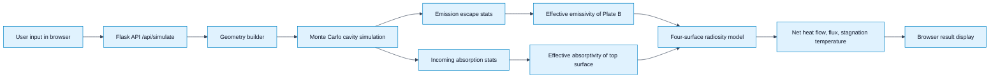
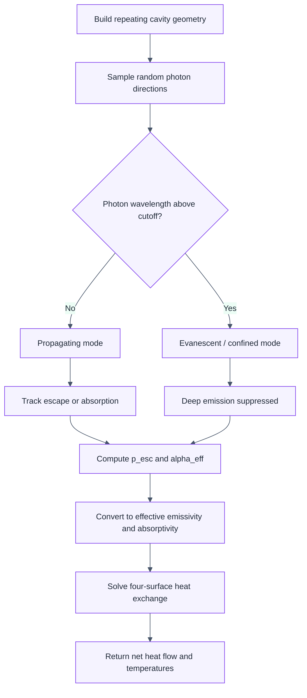

# Monte Carlo Radiative Exchange Simulator

A lightweight Flask web app for estimating radiative heat exchange between two plates when the cooler plate has a structured, cavity-like surface such as a honeycomb panel or CNT forest.

The app combines:

- Monte Carlo ray tracing for the cavity or micro-structured surface,
- cutoff and evanescent-mode logic for sub-wavelength structures,
- a four-surface radiosity enclosure model for total heat transfer,
- a browser interface for parameter exploration and result review.

---

## What this app does

This project models the radiative exchange between:

- Plate A: a hot, flat plate,
- Plate B: a structured plate with micro- or nano-scale cavities,
- surroundings: the environment around the plates.

The simulator estimates values such as:

- effective emissivity of Plate B,
- effective absorptivity of the patterned surface,
- escape probability of thermally emitted photons,
- net radiative heat flux between the plates,
- stagnation temperature of the structured plate under adiabatic conditions.

This is not a full Maxwell solver. It is a practical engineering model designed to capture how structured cavity surfaces can absorb incoming radiation strongly while emitting much less from deep inside the cavity.

---

## App architecture



---

## How the simulator works



The app does not try to simulate every electromagnetic detail of the whole structure. Instead, it uses a practical engineering approximation:

- geometric cavity modeling,
- random photon tracing,
- waveguide cutoff logic for sub-wavelength behavior,
- radiative enclosure modeling for the system-level heat transfer.

---

## Project layout

```text
.
├── app.py                  # Flask app and POST /api/simulate route
├── simulator.py            # Main simulation orchestration
├── ray_tracer.py           # Core Monte Carlo cavity tracing
├── geometry.py             # Cavity geometry definitions
├── sampling.py             # Random sampling utilities
├── spectral.py             # Spectral / material-emissivity helpers
├── static/
│   ├── app.js              # Browser-side result rendering and API calls
│   └── style.css           # UI styling
├── templates/
│   └── index.html          # App UI form and dashboard
├── requirements.txt        # Python dependencies
├── .gitignore              # Standard Python project ignore rules
├── README.md               # Project overview and usage guide
├── monte_carlo_radiation.py
├── rad leakage.py
├── simulation_architecture.md
├── peer review.txt
├── test.py
└── ...
```

---

## Quick start

### 1) Create a virtual environment

```bash
python -m venv .venv
```

On Windows PowerShell:

```powershell
.\.venv\Scripts\Activate.ps1
```

On macOS/Linux:

```bash
source .venv/bin/activate
```

### 2) Install dependencies

```bash
pip install -r requirements.txt
```

### 3) Run the app

```bash
python app.py
```

Then open:

```text
http://127.0.0.1:5000/
```

The browser page lets you select the geometry mode, enter temperatures and dimensions, and run the Monte Carlo simulation.

---

## Simulation API

The app exposes a POST endpoint at:

```text
POST /api/simulate
```

Example request body:

```json
{
  "geometry_mode": "honeycomb",
  "height": 450,
  "cavity_diameter": 20,
  "wall_thickness": 1.0,
  "temp_a": 600,
  "temp_b": 300,
  "temp_surr": 300,
  "emissivity_a": 1.0,
  "emissivity_a_back": 0.1,
  "gap": 100,
  "n_photons": 20000,
  "full_gap_mc": false
}
```

The server responds with JSON containing a `results` object, including values such as:

- `alpha_eff`
- `epsilon_b`
- `p_esc`
- `total_leakage`
- `net_flux_A_front`
- `T_B_stag`
- `view_factor_A_B`
- `near_field_warning`

---

## Notes on usage

- The app defaults to a honeycomb-type geometry if no mode is specified.
- The browser UI accepts a limited set of typical engineering inputs.
- High photon counts increase run time but reduce Monte Carlo noise.
- Very small gap distances can trigger a near-field warning because the model is primarily a far-field radiative approximation.

---

## Feedback and GitHub issues

If you want to leave feedback, report a bug, or suggest an improvement, please open an issue in the project repository.

> Replace the URL below with your actual GitHub repository before publishing this project.

```text
https://github.com/<your-username>/<your-repo>/issues
```

A good issue report should include:

- what you expected to happen,
- what actually happened,
- the exact simulation parameters used,
- the JSON response or screenshot if available,
- the environment you ran it on (Windows/macOS/Linux, Python version).

Suggested issue template:

```md
## Summary
Describe the problem briefly.

## Reproduction steps
1. Start the app
2. Enter these values: ...
3. Click Run Simulation
4. See incorrect result: ...

## Expected behavior
...

## Actual behavior
...

## Environment
- OS:
- Python version:
- Browser:
- Parameters used:
```

---

## Contributing

Contributions are welcome. A good contribution usually includes:

- a clear description of the issue or improvement,
- the relevant simulation parameters,
- a short summary of the expected effect,
- a minimal validation check if possible.

---

## License

This project does not currently declare a license file. If you plan to publish or share it publicly, add an open-source license such as MIT or Apache 2.0.

---

## Recommended next step

If this app will be shared with peers or collaborators, add a repository URL and a small issue template in the GitHub repo so bug reports are easy to submit and track.

That makes it much easier for reviewers to leave formal feedback without needing to dig through the code first.
