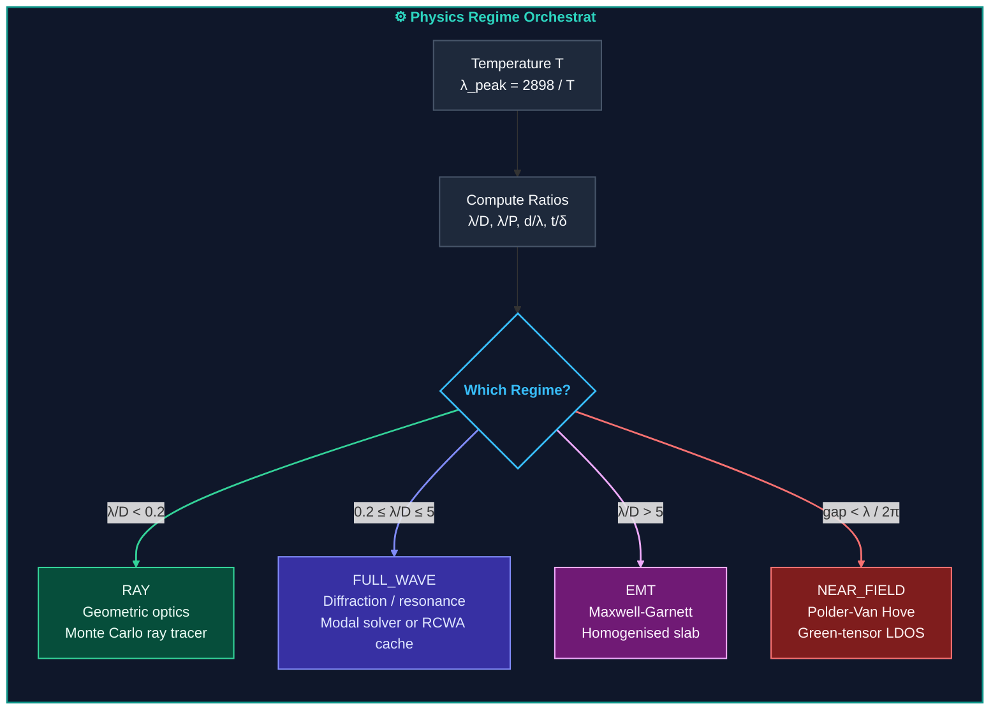
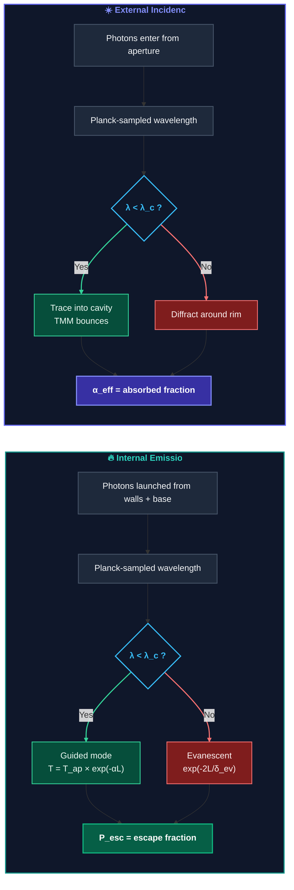
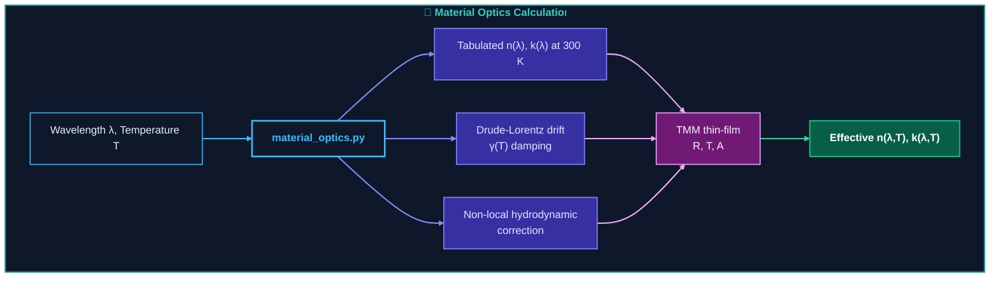
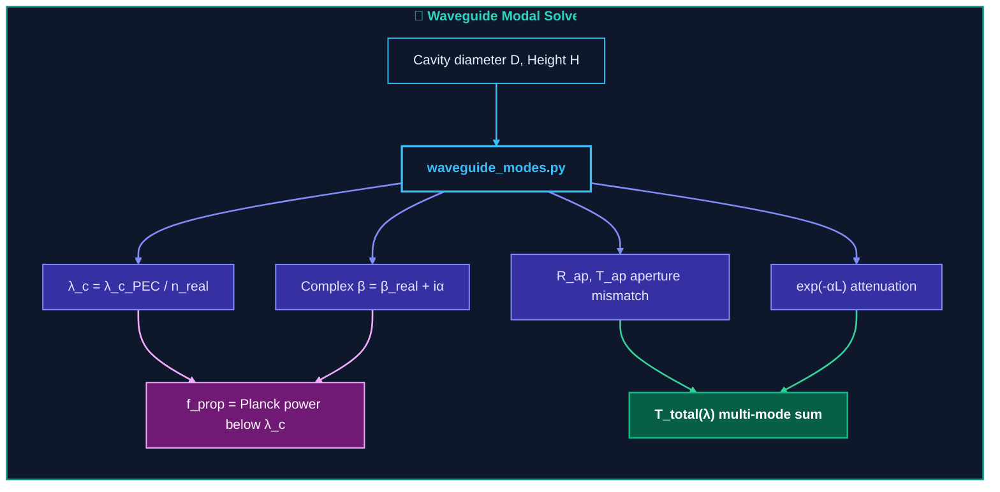
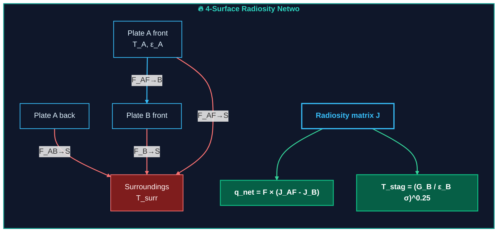

# Monte Carlo Radiative Heat Transfer — Architecture

This document explains how the simulator works in plain language, with visual
diagrams for quick understanding.

## 1. What the simulator answers

| Question                                         | Output                                     |
| ------------------------------------------------ | ------------------------------------------ |
| How easily do thermal photons escape the cavity? | **Escape Probability** P_esc         |
| How much incoming radiation is absorbed?         | **Effective Absorptivity** alpha_eff |
| How much does the structured surface emit?       | **Effective Emissivity** epsilon_B   |
| How much net heat flows between plates?          | **Net Radiative Flux** q             |
| What temperature does Plate B reach if isolated? | **Stagnation Temperature** T_stag    |

---

## 2. High-level data flow

```mermaid
flowchart TD
    %% Class Definitions
    classDef default fill:#1e293b,stroke:#475569,stroke-width:1.5px,color:#f8fafc,font-family:sans-serif;
    classDef inputNode fill:#0f172a,stroke:#38bdf8,stroke-width:1.5px,color:#e0f2fe;
    classDef orchestrator fill:#0f172a,stroke:#38bdf8,stroke-width:2.5px,color:#38bdf8,font-weight:bold;
    classDef rayMode fill:#064e3b,stroke:#34d399,stroke-width:1.5px,color:#ecfdf5;
    classDef fullWaveMode fill:#3730a3,stroke:#818cf8,stroke-width:1.5px,color:#e0e7ff;
    classDef emtMode fill:#701a75,stroke:#f0abfc,stroke-width:1.5px,color:#fdf4ff;
    classDef nearFieldMode fill:#7f1d1d,stroke:#f87171,stroke-width:1.5px,color:#fef2f2;
    classDef outputNode fill:#065f46,stroke:#10b981,stroke-width:2px,color:#ffffff,font-weight:bold;

    %% Subgraph Structure
    subgraph ENGINE["🚀 Simulator Pipeline Architecture"]
        style ENGINE fill:#0f172a,stroke:#0d9488,stroke-width:2px,color:#2dd4bf,font-weight:bold;
      
        A["User enters parameters<br/>(geometry, temperature, materials)"] --> B["Flask API<br/>app.py"]
        B --> C["Build cavity geometry<br/>geometry.py"]
        C --> D["Physics Orchestrator<br/>regime_selector.py"]

        %% Routed Engine Solvers
        D -->|RAY| E["Monte Carlo ray tracer<br/>ray_tracer.py"]
        D -->|FULL_WAVE| F["Waveguide modal solver<br/>waveguide_modes.py"]
        D -->|EMT| G["Maxwell-Garnett TMM slab<br/>material_optics.py"]
        D -->|NEAR_FIELD| H["Polder-Van Hove<br/>near_field_radiative_heat.py"]

        %% Aggregation & Exitance
        E --> I["Effective emissivity ε_B<br/>Effective absorptivity α_eff"]
        F --> I
        G --> I
        H --> I

        I --> J["4-surface radiosity<br/>Net flux, stagnation temperature"]
        J --> K["Results JSON<br/>+ orchestrator provenance"]
    end

    %% Apply Classes to Nodes
    class A,B,C inputNode;
    class D orchestrator;
    class E rayMode;
    class F fullWaveMode;
    class G emtMode;
    class H nearFieldMode;
    class I,J,K outputNode;

    %% Link Styling
    linkStyle 4 stroke:#34d399,stroke-width:2px,fill:none;
    linkStyle 5 stroke:#818cf8,stroke-width:2px,fill:none;
    linkStyle 6 stroke:#f0abfc,stroke-width:2px,fill:none;
    linkStyle 7 stroke:#f87171,stroke-width:2px,fill:none;
```

---

## 3. Physics Orchestrator: regime selection

Before any solver runs, the orchestrator computes dimensionless ratios:

| Ratio                        | Meaning                              | Threshold                                     |
| ---------------------------- | ------------------------------------ | --------------------------------------------- |
| **lambda/D**           | Wavelength vs. feature diameter      | < 0.2 → RAY, 0.2–5 → FULL_WAVE, > 5 → EMT |
| **lambda/P**           | Wavelength vs. pitch                 | EMT when both D, P ≪ lambda                  |
| **d_gap/(lambda/2pi)** | Gap vs. evanescent tunnelling length | < 1 → NEAR_FIELD                             |
| **t_wall/delta**       | Wall thickness vs. absorption depth  | Optically thin if < 0.5                       |

The orchestrator also computes a **confidence score** (0–100%) from regime
penalties, temperature drift, and material extrapolation status. This is
surfaced in the UI as a color-coded badge with explicit warnings.

## 4. Monte Carlo cavity experiments

Two photon-scale experiments run inside the repeating unit cell:

- **P_esc** drives **epsilon_B** (emission side)
- **alpha_eff** drives **alpha_eff** (absorption side)
- Their ratio -> **decoupling ratio**

---

## 5. Thin-film and temperature-dependent optics

---

## 6. Waveguide modal physics

---

## 7. Radiosity enclosure model

---

## 8. Interactive UI features

| Feature              | What it shows                                  |
| -------------------- | ---------------------------------------------- |
| Collapsible sections | Config panels collapse/expand                  |
| Quick presets        | One-click fill: 200K, 3000K, 12000K, room temp |
| Executive summary    | Plain-English interpretation                   |
| Physics status strip | Confidence dot + regime badge                  |
| Regime gauge         | Temperature scale with color zones             |
| Energy flow bars     | Proportional bars: Emitted / Net / Lost        |
| Radiation diagram    | Animated canvas: photon flow A to B            |
| Modal cutoff visual  | Planck curve with lambda markers               |
| Orchestrator banner  | Full regime breakdown + dimensionless ratios   |
| Download report      | Human-readable text with all values            |

---

## 9. One-paragraph summary

The simulator studies a micro-structured surface as a repeating cavity, asks how many photons escape from inside it and how many incoming photons get trapped, and applies thin-film, temperature-dependent complex-optical, roughness-scattering, and modal-cutoff corrections along the way. Those escape and absorption probabilities become effective emissivity and absorptivity values. The code then chooses between near-field and far-field physics and solves a four-surface enclosure to get the net radiative heat flow. The reason this matters is that a structured surface can absorb incident radiation very efficiently while emitting much less from inside its cavities - the anisotropic decoupling the model is built to capture.
