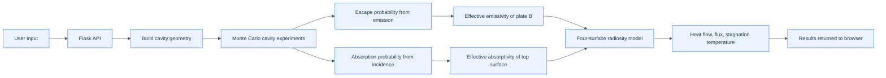
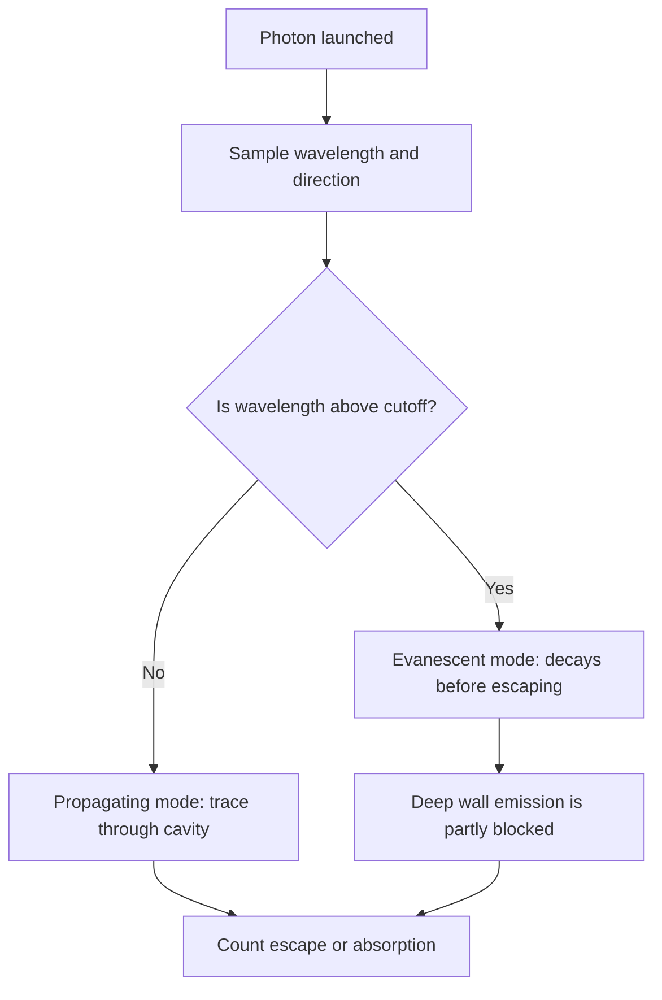
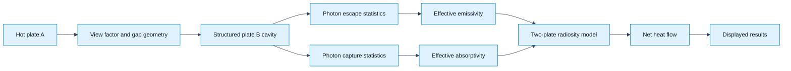

# Monte Carlo Radiative Heat Transfer Simulation

This document explains how the simulator works in plain language while staying faithful to the code.

The app is a small browser-based tool that estimates how much heat passes between two plates when one surface is micro-structured. In practice, that means it models surfaces like honeycomb cavities, CNT forests, or tapered pores, where the top surface can strongly absorb incoming radiation but emit much less thermal radiation from deep inside the structure.

The main idea is simple:

- the code builds a repeating cavity cell for the textured surface,
- it runs a Monte Carlo ray-tracing experiment inside that cavity,
- it estimates how much radiation escapes and how much gets trapped,
- then it uses a larger radiative enclosure model to calculate net heat transfer between the plates.

---

## 1. What the simulator is trying to answer

The simulator answers a practical question:

> If one plate is hot and the other is cooler, how much heat moves across a gap when the cooler plate has a textured cavity surface?

To do that, it estimates:

- how easily thermal photons escape from the cavity,
- how much incoming radiation from above gets absorbed,
- how strongly the structured surface emits heat,
- how much net heat flows between the two plates,
- what temperature the structured plate would reach if it were thermally isolated.

This is not just a single formula. It is a hybrid model: micro-scale cavity physics plus macro-scale radiative exchange.

---

## 2. The app has three layers

| Layer | Files | Purpose |
|---|---|---|
| Front end | templates/index.html, static/app.js, static/style.css | Accept user input, call the API, show results |
| API | app.py | Validate values and run the simulation |
| Physics engine | simulator.py, ray_tracer.py, geometry.py, sampling.py, spectral.py | Build geometry, run the cavity MC model, solve the enclosure problem |

The whole flow is: user inputs → backend validates → geometry is built → cavity MC analysis runs → enclosure calculation runs → results are returned to the browser.

### 2.1 High-level data flow

This is the big picture: the simulator first studies the tiny repeating cavity, then it uses a larger enclosure model to estimate the total heat exchange.

---

## 3. The structured surface is represented as a repeating cavity cell

The geometry layer creates a 3-D repeating unit cell that represents the textured surface. Depending on the selected mode, the cell may be:

- a honeycomb cavity,
- a CNT forest,
- a tapered frustum cavity,
- a rectangular pit (legacy option).

Each geometry object stores things like:

- aperture area,
- wall area,
- base area,
- cavity depth,
- cutoff wavelength,
- cavity enhancement factor.

The code is not modeling a flat plate; it is modeling a pattern of holes, channels, and walls. Those geometric features matter because they trap light in ways a flat surface cannot.

---

## 4. The Monte Carlo part: two experiments on the same cavity

The core function is a cavity Monte Carlo model. It runs two experiments on the same unit cell:

### Experiment 1: Thermal emission from inside the cavity

The code launches many photons from the cavity walls and base. Each photon gets:

- a random starting point on the emitting surface,
- a random direction,
- a wavelength sampled from a Planck distribution,
- a chance to escape, get absorbed, or bounce again.

After many photons, the code estimates the probability of escape, `p_esc`.

This gives the simulator a way to estimate how effectively the cavity emits thermal radiation out through the opening.

### Experiment 2: Incoming radiation from above

The code also launches photons downward through the aperture, then tracks whether they are absorbed or reflected back out.

This produces an effective absorptivity, `alpha_eff`, for the top surface under external illumination.

The important point is that the code separates two behaviors:

- how the surface absorbs incoming light from above,
- how it emits thermal radiation from inside its own cavity.

Those are not always the same for a textured structure.

---

## 5. Why the structure can absorb well but emit poorly

This is the key physical idea behind the model.

Every cavity has a cutoff wavelength. If a photon wavelength is below the cutoff, it can propagate through the cavity. If it is above the cutoff, it becomes evanescent and decays rather than escaping efficiently.

In plain terms:

- incoming radiation can be captured near the opening,
- but thermal photons generated deeper inside the cavity may be strongly confined,
- the geometry suppresses their ability to leave the surface.

This creates the important difference between high absorptivity and low emissivity.

### 5.1 The cutoff decision in the code

That is the part of the code that captures the decoupling between surface capture and internal emission.

---

## 6. The radiative enclosure: converting cavity behavior into total heat flow

Once the cavity properties are known, the code treats the whole setup as an enclosure with four surfaces:

1. Plate A front face,
2. Plate A back face,
3. Plate B structured surface,
4. Surroundings.

The model then solves a radiosity network so it can compute:

- direct exchange from plate A to plate B,
- reflection effects,
- net heat flow,
- how much heat comes from each face.

This is the “macro” part of the simulation. The cavity study tells the model what the structured plate “acts like” as an emitter and absorber. The 4-surface enclosure then uses those effective values to estimate the actual thermal exchange between the plates.

---

## 7. What the numbers mean in practice

The main outputs are meant to be read as follows:

- `alpha_eff`: how well the top structured surface absorbs incoming radiation.
- `epsilon_b`: how strongly the structured surface emits thermal radiation.
- `p_esc`: fraction of internally emitted photons that escape the cavity opening.
- `total_leakage`: total net radiative heat transfer in the enclosure.
- `net_flux_A_front`: net heat flux from plate A to plate B.
- `T_B_stag`: adiabatic temperature the structured plate would reach if it were thermally isolated.

A large difference between `alpha_eff` and `epsilon_b` is not necessarily a bug. In many structured surfaces, it is the expected result of cavity geometry and cutoff physics.

---

## 8. The simulation flow in one sentence

The simulator does this:

1. build a repeating cavity geometry,
2. track random photons inside it,
3. measure how many escape and how many are absorbed,
4. convert that into effective emissivity and absorptivity,
5. solve a larger enclosure problem to find net heat transfer.

That is the real structure of the code.

---

## 9. A more user-friendly end-to-end view

This diagram shows the same idea in a simpler way: the cavity physics sets the effective radiative properties, and the enclosure model translates those into actual heat transfer.

---

## 10. Important caveat

This is not a full electromagnetic solver for every wavelength, every mode, and every exact material interaction. It is a practical engineering model that combines:

- Monte Carlo tracing for cavity behavior,
- cutoff physics for evanescent or trapped modes,
- a radiative enclosure network for the larger system,
- a warning when the gap is small enough that near-field effects may matter.

So the simulator is best understood as a physics-informed approximation for structured radiative surfaces, not as a full wave-solver for all possible optical interactions.

---

## 11. In one paragraph

The simulator works by studying a micro-structured surface as a repeating cavity, then asking how many photons escape from inside it and how many incoming photons get trapped by it. Those escape and absorption probabilities feed into effective emissivity and absorptivity values for the structured surface. After that, the code uses a larger four-surface enclosure model to determine the actual net radiative heat flow between two plates. The reason this matters is that a structured surface can absorb incident radiation very efficiently while emitting much less thermal radiation from inside its cavities, which is exactly the kind of behavior the model is designed to capture.
